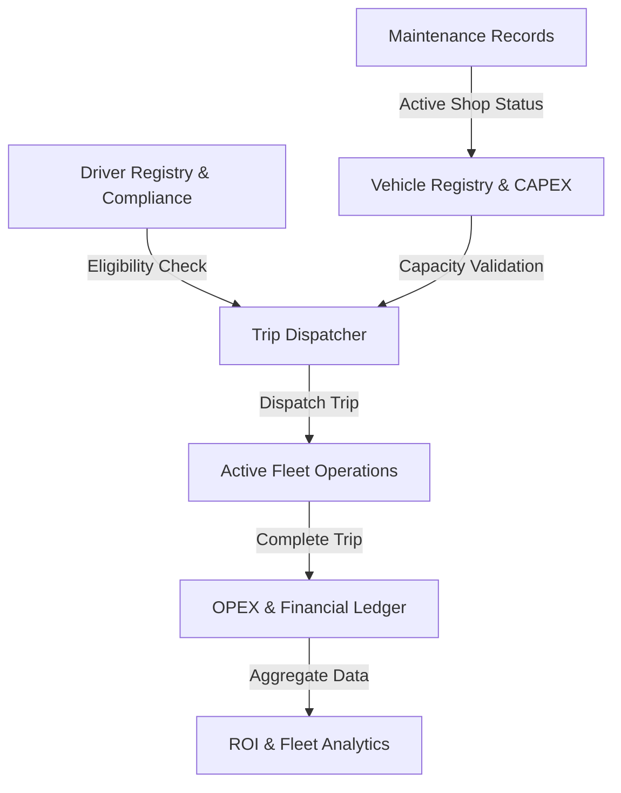

# TransitOps — Enterprise Fleet & Operations Management System
### *Modular ERP Core Integration Blueprint & Operational Command Center*

TransitOps is a unified, full-stack logistics resource planning (LRP) engine designed to bridge the gap between **Fleet Management**, **Human Resources (HR)**, **Maintenance Operations**, and **Financial Ledger Systems**. Built as a high-performance prototype for enterprise logistics pipelines, it demonstrates a complete state-synchronization machine, role-based access controls (RBAC), and transactional compliance.

---

## 🏛 Executive Summary & Business Architecture

Logistics companies often suffer from fragmented operational data. Maintenance records, fuel receipts, driver compliance, and dispatch routes typically live in siloed applications. TransitOps resolves this by consolidating these domains into a single, cohesive state machine:



### Core Business Pillars
1. **Unified Dispatch Pipeline:** Strict cargo weight checking against vehicle payload capacity, ensuring safety and preventing mechanical overload.
2. **HR & Safety Compliance:** Automatically blocks suspended drivers or operators with expired commercial licenses from route assignment.
3. **OPEX & Depreciation Tracking:** Captures fuel efficiency and logs toll/miscellaneous expenses, translating them automatically into operational cost ledgers.
4. **Maintenance State-Machine Sync:** Active maintenance triggers lockouts on vehicles, moving them out of the dispatch pool until certified as "Available" by a Fleet Manager.

---

## 🛠 Tech Stack & Systems Design

The architecture is built for rapid deployment, strict type safety, and transactional ACID compliance:

*   **Frontend Client:** React 18, TypeScript, Tailwind CSS, Recharts (data visualization), React Query v5 (state caching and automatic background refetching), React Router v6.
*   **Backend Server:** Node.js, Express, TypeScript.
*   **Data Tier:** SQLite engine, managed via Prisma ORM.
*   **Authentication & Security:** JSON Web Tokens (JWT) with encoded role payloads, incorporating temporary account lockout security (5 failed attempts locks the operator for 15 minutes).

### ACID Compliance & Transactional Integrity
State transitions are wrapped in atomic database transactions (`prisma.$transaction`). For example, when completing a trip:
1. The **Trip** status changes to `Completed` with final odometer and fuel readings.
2. The **Vehicle** odometer is updated and its status is set back to `Available`.
3. The **Driver** status is set back to `Available`.
4. A **FuelLog** entry is logged, calculating total fuel cost based on liters consumed.
5. An **Expense** record is instantiated, tracking tolls and driver incidentals.

If any of these updates fail, the entire transaction is rolled back, preventing orphaned trips or desynced vehicle registers.

---

## 📊 Fleet Analytics & ROI Calculations

TransitOps implements a live financial calculation engine mapping operational expenses (OPEX) against capital expenditures (CAPEX):

### 1. Return on Investment (ROI)
For each vehicle asset, the Return on Investment is calculated dynamically based on generated trip revenue vs. operational costs relative to its acquisition price:
$$\text{ROI} = \frac{\text{Trip Revenue} - (\text{Maintenance Costs} + \text{Fuel Costs})}{\text{Acquisition Cost}} \times 100\%$$
*Where Trip Revenue is calculated dynamically as $\text{Planned Distance (km)} \times ₹15/\text{km}$ for completed trips.*

### 2. Fleet Utilization
Tracks the percentage of active resources deployed relative to the total registered fleet:
$$\text{Fleet Utilization} = \frac{\text{Vehicles On Trip}}{\text{Total Fleet (Excluding Retired)}} \times 100\%$$

---

## 🔌 Modular ERP Core Integration Strategy (API Blueprint)

TransitOps is designed to serve as a high-speed operational gateway that interfaces with standard **Enterprise ERP** instances. By leveraging standard API connectors, TransitOps acts as the real-time driver/dispatcher interface while syncing core accounting and HR data back to the central ERP.

```text
  [ TransitOps Client ]  <--->  [ TransitOps Server ]
                                          |
                                    (JSON-RPC / REST)
                                          |
                                          v
                      +---------------------------------------+
                      |         Enterprise ERP Core           |
                      |  - HR Employees (Drivers)             |
                      |  - Fleet Assets (Vehicles)            |
                      |  - Accounting Ledger (Expenses)       |
                      +---------------------------------------+
```

### Model Mapping Blueprint

| TransitOps Model | ERP Core Model | Sync Trigger |
| :--- | :--- | :--- |
| **Driver** | `hr_employee` (with license attributes) | Onboarded driver syncs to ERP HR directory. |
| **Vehicle** | `fleet_vehicle` | Asset registration syncs to ERP Asset Management. |
| **FuelLog** | `fleet_vehicle_log_fuel` | Trip completion creates a fuel expense line in ERP. |
| **Expense** | `account_move_line` / `hr_expense` | Tolls and incidentals post directly as journal entries. |
| **MaintenanceRecord** | `fleet_vehicle_log_services` | Active service logs register in ERP Maintenance module. |

---

## 🚀 Setup & Execution Guide

### Installation
Ensure Node.js (v18+) is installed on your local system.

1. Clone the project and install root dependencies:
   ```bash
   npm install --legacy-peer-deps
   ```
2. Initialize and configure workspace package trees:
   ```bash
   npm run setup
   ```
3. Generate the Prisma database client and push the schema:
   ```bash
   npm run prisma:generate
   npm run prisma:push
   ```
4. Load the mock database seed (creates demo vehicles, drivers, and user role profiles):
   ```bash
   npm run seed
   ```

### Running the Application
Launch both the backend server and the frontend client concurrently:
```bash
npm run dev
```

*   **Frontend Dashboard Console:** [http://localhost:5173](http://localhost:5173)
*   **Backend REST Gateway:** [http://localhost:3001](http://localhost:3001)

---

## 🔐 Role-Based Access Control (RBAC) Matrix

TransitOps enforces route guarding on both the UI navigation and API endpoints according to the following permissions:

| Access Role | Fleet Module | Drivers Module | Trips Module | Fuel/Exp Module | Analytics Module |
| :--- | :---: | :---: | :---: | :---: | :---: |
| **Fleet Manager** | `✓ Edit` | `✓ Edit` | `—` | `—` | `✓ Edit` |
| **Dispatcher** | `view` | `—` | `✓ Edit` | `—` | `—` |
| **Safety Officer** | `—` | `✓ Edit` | `view` | `—` | `—` |
| **Financial Analyst** | `view` | `—` | `—` | `✓ Edit` | `✓ Edit` |

### Demo Access Credentials (Password: `demo1234`)
*   💼 **Fleet Manager:** `fleet@demo.com`
*   🚚 **Dispatcher:** `dispatch@demo.com`
*   🛡️ **Safety Officer:** `safety@demo.com`
*   📊 **Financial Analyst:** `finance@demo.com`